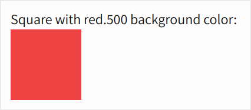
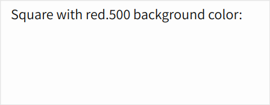

In this demo, a red square should appear on the main page. However, a discrepancy from Panda v0.41 to v0.42 coupled with config/library code prevents tokens from generating CSS properly in the [Omni Sigil UI kit](https://github.com/omnidotdev/sigil) package. There are two main directories:

- `panda-0.41` which is a Next.js app that uses Omni Sigil and Panda CSS v0.41, and
- `panda-0.42` which is a Next.js app that uses Omni Sigil and Panda CSS v0.42.

Panda CSS v0.42 changelog: https://github.com/chakra-ui/panda/blob/main/CHANGELOG.md#0420---2024-07-08

## Reproduction

In `panda-0.41` and `panda-0.42` separately, run `bun dev` and navigate to the local URLs. Notice that the red square generates in `panda-0.41`, but not in `panda-0.42`.

0.41:

0.42:

